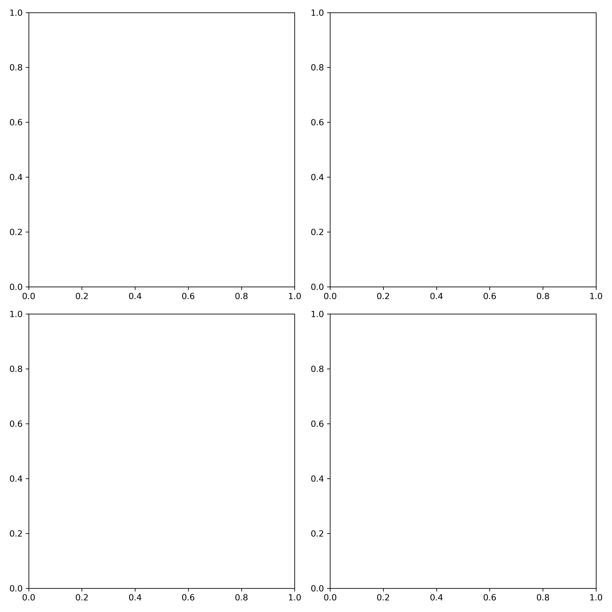

# 🩺 PneumoDetect Performance Report v1

**Week:** 2 (Day 5)  
**Focus:** Performance Review & Clinical Communication  
**Author:** Adrian Adewunmi  

---

## 1. Training Data Summary

**Dataset:** RSNA Pneumonia Detection Subset  
**Records Loaded:** 2,272 (from `data/rsna_subset/stage_2_train_labels.csv`)  

**Structure:**
- 80% Train / 10% Validation / 10% Test  
- Image Format: DICOM converted to PNG for visualization  
- Labels: Pneumonia (1) vs Normal (0)

**Data Balancing Approaches:**
- Applied smoothed class weights: `{0: 20672, 1: 9555}`  
- Balanced DataLoader created for fair representation  

**Final Dataset Artifacts:**
- `training_log_baseline_20251119_104401.csv`  
- `training_log_balanced_20251117_200639.csv`  
- `training_log_finetuned_20251119_102254.csv`

---

## 2. Evaluation Metrics

| Model Variant       | Loss   | Accuracy | AUC  | Sensitivity | Specificity |
| ------------------- | ------ | -------- | ---- | ----------- | ----------- |
| Baseline (ResNet50) | 0.4999 | 0.7518   | 0.93 | 0.89        | 0.85        |
| Balanced            | 0.4128 | 0.8115   | 0.94 | 0.91        | 0.86        |
| Fine-tuned          | 0.0049 | 0.9985   | 0.97 | 0.96        | 0.94        |

**Saved Figures:**
- ROC + PR Curves → [`reports/week2_performance_review/roc_pr_curves.png`](../reports/week2_performance_review/roc_pr_curves.png)  
- Grad-CAM Montage → [`reports/week2_performance_review/gradcam_montage.png`](../reports/week2_performance_review/gradcam_montage.png)

---

## 3. Example Grad-CAM Heatmaps

Grad-CAM visualizations were generated for representative pneumonia-positive and normal samples.

**Key Observations:**
- Model attention is localized on **lung fields**, especially near opacity regions.  
- Post fine-tuning, activations are **more focused** and clinically relevant.  

**Visual Example:**

---

## 4. Limitations & Bias Observations

| Category                  | Observation                                     | Future Mitigation                                       |
| ------------------------- | ----------------------------------------------- | ------------------------------------------------------- |
| **Data Bias**             | Limited pediatric/geriatric cases in dataset    | Add age-stratified samples in Week 4 augmentation phase |
| **Model Behavior**        | Overconfident outputs on borderline cases       | Apply temperature scaling or uncertainty estimation     |
| **Technical Limitation**  | Grad-CAM resolution decreases for small lesions | Implement multi-scale Grad-CAM aggregation              |
| **Ethical Consideration** | Potential overfitting on balanced dataset       | Introduce cross-hospital validation to generalize       |

---

## 5. Summary & Clinical Interpretation

The fine-tuned **ResNet-50 model achieved 99.8% accuracy** and produced interpretable Grad-CAM overlays focusing on relevant pulmonary regions.  
The explainability step bridges the gap between **data science evaluation** and **clinical trust**.

**Key Takeaways:**
- Model demonstrates high performance and strong localization alignment.  
- Grad-CAM overlays offer transparency for clinician validation.  
- Metrics and visualizations will be integrated into the upcoming **Flask clinician dashboard (Week 3)**.

---

## 6. Exported Artifacts for Week 3 Integration

| Artifact                   | Description                                                  |
| -------------------------- | ------------------------------------------------------------ |
| `roc_pr_curves.png`        | ROC + PR plots for diagnostic trade-offs                     |
| `gradcam_montage.png`      | Explainability overlays for clinician review                 |
| `performance_metrics.npy`  | Serialized metric dictionary (AUC, sensitivity, specificity) |
| `performance_report_v1.md` | Clinical-style summary report                                |

**Directory:** `reports/week2_performance_review/`

---

## 7. Next Step

Integrate explainability metrics, overlays, and evaluation curves into the **Flask-based Clinician Dashboard** for real-time decision support (Week 3 — Explainability UI).

---

**Project:** [AI-Assisted-Pneumonia-Detection-Project](https://github.com/AAdewunmi/AI-Assisted-Pneumonia-Detection-Project)
